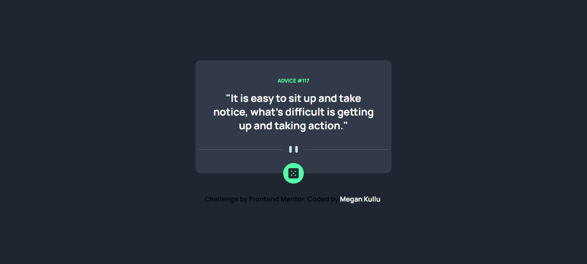

# Frontend Mentor - Advice generator app solution

This is a solution to the [Advice generator app challenge on Frontend Mentor](https://www.frontendmentor.io/challenges/advice-generator-app-QdUG-13db). Frontend Mentor challenges helps one improve their coding skills by building realistic projects.

## Table of contents

- [Overview](#overview)
  - [The challenge](#the-challenge)
  - [Screenshot](#screenshot)
  - [Links](#links)
- [My process](#my-process)
  - [Built with](#built-with)
  - [What I learned](#what-i-learned)
  - [Continued development](#continued-development)
  - [Useful resources](#useful-resources)
- [Author](#author)


## Overview

### The challenge

Users should be able to:

- View the optimal layout for the app depending on their device's screen size
- See hover states for all interactive elements on the page
- Generate a new piece of advice by clicking the dice icon

### Screenshot



### Links

- Solution URL: [Add solution URL here](https://your-solution-url.com)
- Live Site URL: [Add live site URL here](https://your-live-site-url.com)

## My process

### Built with

- Semantic HTML5 markup
- CSS custom properties
- Flexbox
- CSS Grid
- Mobile-first workflow
- Javascript promises

### What I learned

I re-inforced my learning of promises and how to destructure objects.

```javascript
fetch("https://api.adviceslip.com/advice")
    .then(response => response.json())
    .then(respObj => {
        displayData(respObj);
    })
```

### Continued development

I want to continue implementing the javascript promises in my projects and to dynamically render the responses to the front-end.


### Useful resources

- [Youtube.com](https://www.example.com) - This helped me for understand promises. The explanation was simple and straightforward.


## Author
- LinkedIn - [@Megan Kullu](https://www.linkedin.com/in/megankullu/)
- Frontend Mentor - [@MeganKullu](https://www.frontendmentor.io/profile/MeganKullu)
- Twitter - [@megankullu](https://www.twitter.com/megankullu)


